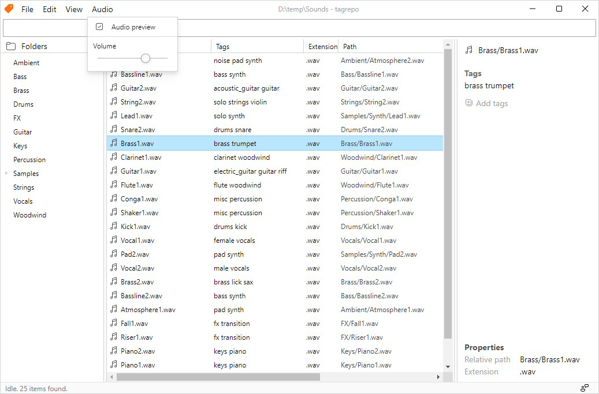

# tagrepo

## これは何ですか？

tagrepoはファイルにタグを付ける機能を備えたファイルマネージャーです。多くのファイルを含むフォルダを管理するために設計されており、ファイルを素早く検索し、簡単にタグ付けすることができます。

現在は、オーディオ制作ユーザー向けにオーディオプレビューなどの機能を備えていますが、ほとんどの他の用途にも完璧に適しています。将来的には、画像プレビューやプラグインサポートなどの機能を拡張する予定です。

実装された機能：

- ファイルタグ付け
- タグやパス名での検索をサポートする柔軟な検索エンジン
- Windows上でのファイル追跡 _（他のプラットフォームは未検証ですが、動作するはずです）_
- ディレクトリによるフィルタリングのための「Folder」パネル
- オーディオプレビュー _（WIP）_

計画された機能：

- 画像プレビュー
- ファイルのソート
- より優れたクロスプラットフォームの互換性
- ... などなど！

## ダウンロード

**注意：** このアプリケーションは主にWindowsでテストされました。Linuxでは最小限のテストが行われ、MacOSではテストが行われていません（Macを所有していないため）。

バージョン0.0.1：

- [Windows](https://github.com/jamesWalker55/tag-repo/releases/download/tagrepo-v0.0.1/tag-repo_0.0.1_x64_en-US.msi)
- [MacOS _（未テスト）_](https://github.com/jamesWalker55/tag-repo/releases/download/tagrepo-v0.0.1/tag-repo_0.0.1_x64.dmg)
- [Linux _（未テスト）_](https://github.com/jamesWalker55/tag-repo/releases/download/tagrepo-v0.0.1/tag-repo_0.0.1_amd64.deb)
- [その他のダウンロードオプション](https://github.com/jamesWalker55/tag-repo/releases/tag/tagrepo-v0.0.1)

## アンケート

私は、コンピュータサイエンスコースの最終プロジェクトの一環として、このソフトウェアを開発しています。tagrepoを試したことがある場合は、このアンケートに回答して、プロジェクトを評価するのに役立ててください。

[Google Formsへのリンク](https://forms.gle/9td2pvuiChCbihe46)
