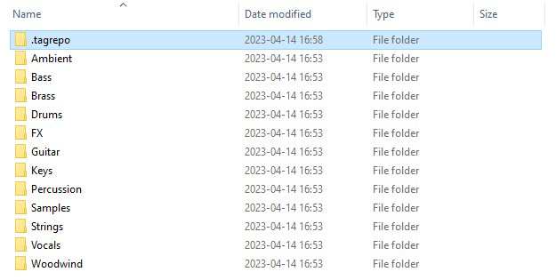
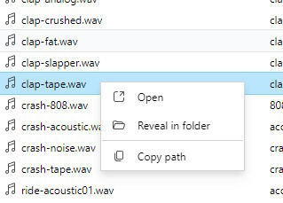
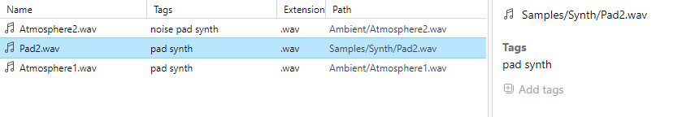
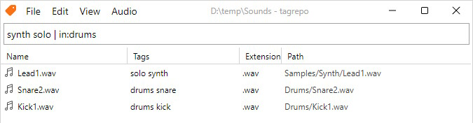

# 基本用法

tagrepo 操作的对象是文件夹。当你启动软件后，文件列表将保持为空，直到你选择一个文件夹作为 **Repository（储存库）**。选择文件夹后，tagrepo 将扫描文件夹并构建文件路径列表。完成后，你可以给文件分配标签并搜索文件。

## Repositories



“Repository”是一个文件夹。tagrepo一次只能在一个“Repository”中（一个文件夹）进行操作。

每个“Repository”都包含名为“.tagrepo”的文件夹。该文件夹包含tagrepo需要的所有信息，如文件路径和标签。如果文件夹还没有“.tagrepo”文件夹，tagrepo会自动在文件夹的根目录中创建一个“.tagrepo”文件夹。

## 文件操作



要访问列表中的文件，您可以右键单击文件以显示上下文菜单。从菜单中，您可以打开文件、显示文件（打开包含文件的文件夹）或复制文件路径。

您也可以选择列表中的多个文件，然后右键单击以同时操作它们。按住 Shift 键并单击两个文件以创建范围选择，按住 Ctrl 键以逐个选择每个文件。

## 给文件打标签



一个文件可以被赋予标签。标签名称中不能包含空格，因为空格会被用来分隔不同的标签。如果您希望创建包含多个单词的标签，可以考虑在标签中使用 `-` 或 `_` 字符。

例如，`my cool tag` 是无效的标签，因为 tagrepo 会将其视为 3 个独立的标签：`my`、`cool` 和 `tag`。您可以考虑使用像 `my-cool-tag` 这样的标签名称。

在属性面板中可以完成给文件打标签的操作。点击 **Add tags** 按钮，输入框将会出现。您可以在输入框中输入一组标签，以添加到您所选择的文件中（多个标签必须用空格分隔）。

要从文件中移除标签，先选择该文件。在属性面板中，单击您想要移除的标签。您的鼠标指针悬停在标签上时，将会看到该标签的高亮显示。

## 查询



tagrepo 支持灵活的查询语言，可以通过标签或相对路径搜索文件。

您可以通过标签名称搜索包含该标签的文件。如果要搜索多个标签，请键入每个标签的名称，用空格分隔：

```
tag1　tag2　tag3　你好　再见
```

查询栏还支持通过文件路径进行搜索。这些搜索运算符以运算符名称（例如 `in`）开头，后跟冒号 `:`，然后是要搜索的文本。您可以在文本中使用引号（`"`,`'`）来包含搜索中的空格。目前支持五个搜索运算符：`inpath`、`in`、`ext`、`children`、`leading`。这些将在[高级搜索运算符]()中讨论。

```
in:鼓
inpath:“你好 世界”
```

所有这些操作符都可以自由地与布尔运算符组合。操作符包括`|`代表"或"，`-`代表"非"。连续的多个搜索术语被视为"与"组。括号（`(`，`)`）也可以用于分组搜索条件。

```
kick drum (my_sample_pack | in:'Freesound' | in:'rendered_audio')
```
