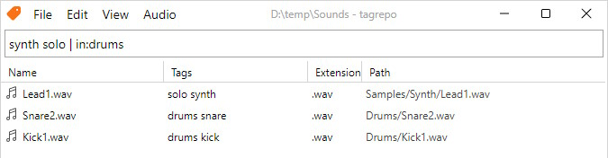

## 基本的な使用法

tagrepo はフォルダを操作します。ソフトウェアを起動すると、ファイルリストは空のままで、**リポジトリ（Repository）** として機能するフォルダを選択するまで、何も表示されません。フォルダを選択すると、tagrepo はフォルダをスキャンし、ファイルパスのリストを構築します。これが完了したら、ファイルにタグを割り当てたり、ファイルを検索したりできます。

### Repositories


「Repository（リポジトリ）」とは、1つのフォルダのことです。tagrepoは1つのリポジトリ（フォルダ）につき、1度に1つしか操作できません。

すべてのリポジトリには、フォルダ名が「.tagrepo」というフォルダが含まれています。このフォルダには、tagrepoが必要とするすべての情報が含まれています。ファイルのパスやタグなどです。もしフォルダにまだ「.tagrepo」フォルダがない場合、tagrepoは自動的にフォルダのベースに「.tagrepo」フォルダを作成します。

### ファイルのタグ付け


ファイルにはタグを付けることができます。タグにはスペースを含めることはできません。各タグを区切るためにスペースが使用されるためです。複数の単語を含むタグを作成する場合は、`-` や `_` のような文字を使用することを検討してください。

例えば、 `my cool tag` は無効なタグです。tagrepo では、 `my` 、 `cool` 、 `tag` の3つのタグとして扱われます。代わりに `my-cool-tag` のようなタグを使用することができます。

タグ付けはプロパティパネルを介して行われます。**タグを追加**ボタンをクリックして入力フィールドを表示し、選択したファイルに追加するタグのリストを入力します（タグはスペースで区切られる必要があります）。

ファイルからタグを削除するには、まずファイルを選択してください。次に、プロパティパネルで削除するタグをクリックします。マウスオーバーすると、削除対象のタグがハイライト表示されます。

### クエリ



tagrepoは柔軟なクエリ言語をサポートしています。この言語を使うと、タグや相対パスによってファイルを検索することができます。

タグを持つファイルを検索するには、単にタグの名前を入力します。複数のタグで検索する場合は、各タグの名前をスペースで区切って入力します。

`tag1 tag2 tag3 hello goodbye`

クエリバーはファイルのパスによる検索もサポートしています。検索演算子は、演算子名（例えば `in`）、コロン `:`、そして検索するテキストで構成されます。テキスト内にスペースを含めるには、引用符（`"`、`'`）を使用できます。現在、5つの検索演算子がサポートされています: `inpath`、`in`、`ext`、`children`、`leading`。これらについては、後述する「[高度な検索演算子]()」で詳しく説明します。

```
in:drums
inpath:"hello world"
```

これらのオペレーターは、ブール演算子と自由に組み合わせることができます。オペレーターには、「または」を表す `|`、および「でない」を表す `-` が含まれます。シーケンス内の複数の検索用語は「かつ」グループとして扱われます。かっこ `(`, `)` によって、検索用語をグループ化することもできます。

```
kick drum (my_sample_pack | in:'Freesound' | in:'rendered_audio')
```
