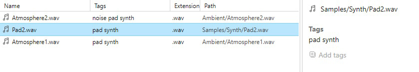

## Basic Usage

tagrepo operates on folders. When you start the software, the file list remains empty until you choose a folder to act as a **repository**. After choosing a folder, tagrepo scans the folder and builds a list of file paths. After this is complete, you can then assign tags to files, as well as search for files.

### Repositories


A repository is a single folder. tagrepo operates in a single repository (folder) at a single time.

Every repository contains a folder named `.tagrepo`. This folder contains all the information tagrepo needs, like file paths and tags. If a folder doesn't yet have a `.tagrepo` folder, tagrepo automatically creates a `.tagrepo` folder at the base of the folder.

### Tagging files



A file can be assigned tags. A tag cannot contain spaces, since spaces are used to separate each tag. If you wish to create a tag with several words, consider using characters like `-` or `_` in the tag.

For example, `my cool tag` is an invalid tag - it gets treated as 3 separate tags by tagrepo: `my`, `cool`, and `tag`. You can consider using a tag like `my-cool-tag` instead.

Tagging is done through the properties panel. Click on the **Add tags** button to display an input field. You can then type in a list of tags to be added to the file you have selected (the tags must be separated by spaces).

To remove a tag from a file, first select the file. On the properties panel, click on the tag you want to remove. The tag to-be-removed will be highlighted as you mouse over it.

### Queries


tagrepo supports a flexible query language. It lets you search for files by tags or by their relative path.

You search for a file containing a tag by simply typing the name of the tag. If you want to search for multiple tags, type the name of each tag, separated by a space:

```
tag1 tag2 tag3 hello goodbye
```

The query bar also supports searching by the path of the file. These search operators begin with the name of the operator (e.g. `in`), followed by a colon `:`, then the text to search for. You can use quotes (`"`, `'`) in the text to include spaces in the search. Currently, five search operators are supported: `inpath`, `in`, `ext`, `children`, `leading`. These will be discussed later in [Advanced search operators](https://jameswalker55.github.io/tag-repo-site/#manual-advanced-search).

```
in:drums
inpath:"hello world"
```

All of these operators can be combined freely with boolean operators. The operators include `|` for "or", and `-` for "not". Multiple search terms in a sequence are treated as an "and" group. Parenthesis (`(`, `)`) may also be used to group search terms.

```
kick drum (my_sample_pack | in:'Freesound' | in:'rendered_audio')
```
