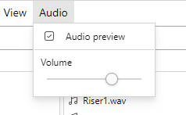

# 追加機能

## フォルダパネル

フォルダパネルは、アイテムをフォルダ構造に基づいて検索できるようにする機能です。初期状態では非表示になっており、ツールバーの「`View > Folders`」から表示できます。

デフォルトでは、フォルダパネルは、そのフォルダの**直接の子**であるファイルを検索します。つまり、指定されたパスのサブフォルダ内にあるファイルを検索しません。この動作は、パネルの設定である「**Recursive**」オプションで変更できます。このオプションを有効にすると、フォルダパネルは、指定されたパスのサブフォルダにあるアイテムも検索します。

## オーディオプレビュー

_注：オーディオプレビューはまだ早期開発段階にあり、時々バグが発生する可能性があります。_

オーディオプレビュー機能により、アイテムをクリックすると音声ファイルを再生できます。これはデフォルトでは無効になっており、ツールバーから有効にすることができます： `Audio > Audio preview`

オーディオプレビューを有効にすると、tagrepoは以下のファイル形式をプレビューできます：`.mp3`、`.wav`、`.flac`、`.ogg`。ファイルをプレビューするには、リスト内のファイルをクリックします。
