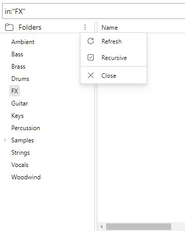
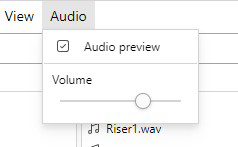

# Extra Features

## The folder panel

The folder panel allows you to search for items based on their folder structure. This is hidden by default and can be enabled through the toolbar: `View > Folders`

By default, the folder panel searches for files that are **direct children** of the folder. This means it does not search for files that are inside subfolders of the given path. This behaviour can be changed with the **"Recursive"** option in the panel settings. When enabled, the folder panel also searches for items that are in subfolders of the given path.

## Audio preview

_Note: Audio preview is still in early development and may be buggy at times._

The audio preview feature allows tagrepo to play an audio file when you click on an item. This is disabled by default and can be enabled through the toolbar: `Audio > Audio preview`

After enabling audio preview, tagrepo is able to preview the following file types: `.mp3`, `.wav`, `.flac`, `.ogg`. To preview a file, click on a file in the list.
